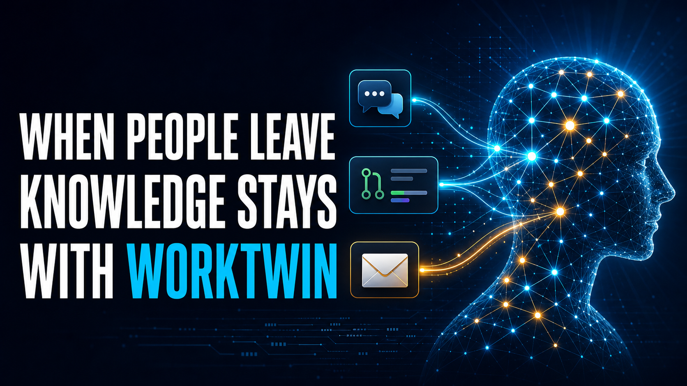

# WorkTwin

> An AI-powered organizational memory SaaS that creates an evidence-backed Work Twin for every employee from the work they actually do.

## 🎬 Hackathon Demo

[](https://youtu.be/1_yStyEEEJU)

Watch the 90-second product demo: [WorkTwin on YouTube](https://youtu.be/1_yStyEEEJU)

## 🤖 Built with OpenAI

### Codex

Codex was our hands-on development partner throughout the hackathon. It helped implement and iterate on the React/Vite experience, FastAPI retrieval layer, Supabase schema and ingestion pipelines, test coverage, deployment configuration, and the final demo polish. Codex also drove the disciplined Git workflow: focused feature branches, verification, pull requests, and production deployment checks.

### GPT-5.6 and the OpenAI API

WorkTwin uses the official OpenAI Python SDK and GPT-5.6 through the Chat Completions API to turn retrieved, permitted organizational evidence into grounded Twin answers, implementation plans, and code drafts. Every substantive response is instructed to cite the supplied evidence and to respect the historical-Twin and human-approval guardrails. `text-embedding-3-small` creates the vector embeddings used to retrieve relevant Slack, GitHub, and email artifacts before GPT-5.6 responds.

## 🌟 Vision

Organizations lose valuable knowledge every time an employee changes roles or leaves the company.

WorkTwin connects to company work artifacts and continuously builds a Work Twin for each employee. A Twin preserves demonstrable expertise, decision-making context, technical ownership, and collaboration patterns so teammates can retrieve institutional knowledge long after a role changes or an employee leaves.

The goal is not to replace employees, but to preserve institutional knowledge and enable continuous collaboration.

---

## 🎯 Core Principles

- Each employee has one Work Twin, created from their work artifacts rather than from a manually written persona.
- A Twin's expertise, working style, and communication patterns are derived and refreshed from evidence.
- Every substantive answer is grounded in retrievable company memory and returns source citations.
- Departed employees remain available as clearly labelled historical Twins, subject to company permissions.
- Human approval is required for critical or external actions.

---

## 🏗️ System Architecture

```text
Organization (SaaS tenant)
├── Source connections / demo imports
│   ├── Slack: messages and threads
│   ├── GitHub: pull requests, reviews, commits, and issues
│   └── Email: formal decisions, cross-team communication, and handovers
├── Employee directory
│   └── active and departed employees, linked to source identities
├── Organizational memory (Supabase + pgvector)
│   └── normalized artifacts, memory chunks, embeddings, access scope, and provenance
├── Work Twin profiles
│   └── derived expertise, ownership, decision patterns, and communication summary
└── Twin interaction layer
    └── cited Q&A, implementation planning, and code drafts with human approval
```

---

## 🤖 Work Twin model

Each Twin is an evidence-backed representation of an employee's work context. It is not a separately trained model and does not require the employee to manually author a personality.

### 1. Employee identity and lifecycle
- **Identity**: Name, role, department, and linked Slack/GitHub/email identities.
- **Lifecycle**: `active` or `departed`. Departed Twins and their permitted historical memory remain part of the organization.

### 2. Derived work profile
- **Expertise and ownership**: Repositories, systems, projects, technical topics, and recurring responsibilities inferred from work artifacts.
- **Working patterns**: Decision preferences, planning and debugging habits, and communication summary inferred from evidence and refreshable as data changes.

### 3. Long-term, cited memory
- **Memory**: Original Slack discussions, GitHub activity, emails, documents, decisions, and incident records, with author, timestamp, source URL, and access scope.
- **Retrieval**: Queries retrieve relevant employee and shared organizational memory before generating a response; answers expose their sources.

---

## 📈 Learning sources

Twins continuously update from connected or imported work artifacts:

- Slack messages and threads
- GitHub pull requests, reviews, commits, and issues
- Email conversations, decisions, approvals, and handovers
- Technical and design documents, meeting transcripts, Jira tickets, feedback, and incident reports

For the hackathon MVP, these sources are represented through curated, repeatable demo imports. Production connectors and webhooks follow the same ingestion contract.

### Demo connector boundary

Live Slack, GitHub, and email OAuth/webhook connectors are post-MVP. The demo uses controlled imports so every run is repeatable while preserving the production ingestion contract: source identity, provenance, timestamps, and access scope are validated before retrieval.

Run the import pipeline locally from `backend/`:

```bash
.venv/bin/python -m app.demo_imports
.venv/bin/python -m app.artifact_embeddings
.venv/bin/python -m app.derived_profiles
```

---

## 💬 Core user experience

Users select an employee from the directory and ask that person's Twin about prior decisions or request a work artifact such as an implementation plan or code draft:

```text
User ➔ Employee Twin ➔ retrieve employee + permitted organization memory ➔ cited response / draft
```

Example: a teammate can ask a departed backend engineer's Twin why a retry limit was selected, inspect the Slack and pull-request evidence, then request a compatible webhook implementation plan. The Twin never implies that it is the former employee responding in real time.

---

## 🔒 Human-in-the-loop (Guardrails)

* **Twins MAY**: Answer company-knowledge questions with citations, draft code, review code, generate documentation, and suggest architecture.
* **Twins MUST NOT**: Deploy to production, approve pull requests, bypass artifact access controls, or modify production systems **without human approval**.
* **Email and sensitive artifacts**: Retrieval must respect an artifact's company-shared or restricted access scope; private or restricted email is never indiscriminately available to every Twin.

---

## 🛠️ Tech Stack & Getting Started

### Tech Stack
- **Frontend**: React (Vite, TypeScript, Tailwind CSS, Shadcn UI)
- **Backend**: Python (FastAPI)
- **AI Core**: Official OpenAI Python SDK (GPT-5.6 / Assistants API)
- **Database**: Supabase (PostgreSQL + pgvector)

### Development Setup
1. Clone the repository.
2. Install Python dependencies: `pip install -r requirements.txt`
3. Install frontend dependencies: `cd frontend && npm install`
4. Set up `.env` with `OPENAI_API_KEY` and `SUPABASE_URL`.

### Backend (Phase 1)

```bash
cd backend
python3 -m venv .venv
source .venv/bin/activate
python -m pip install -r requirements.txt
cp ../.env.example ../.env
uvicorn app.main:app --reload
```

Set `OPENAI_API_KEY` in the root `.env`, then send a request to `POST /api/chat`:

```json
{"message":"Hello, WorkTwin!"}
```

### Frontend (Phase 1)

In a second terminal, start the Vite development server:

```bash
cd frontend
npm install
npm run dev
```

The frontend runs on `http://localhost:5173` and proxies `/api` requests to the
FastAPI server at `http://127.0.0.1:8000`.

### Verification

Before opening a pull request, run the backend tests and production frontend build:

```bash
(cd backend && .venv/bin/python -m pytest)
(cd frontend && npm run build)
```

The root `.env` must define `OPENAI_API_KEY`, `OPENAI_MODEL`, `SUPABASE_URL`, and `SUPABASE_SERVICE_ROLE_KEY`. Keep these values local and never commit the file.

### Hackathon deployment

Deploy the frontend to Vercel and the FastAPI API to Render. Supabase remains the managed database and vector store.

1. In Render, create a new **Blueprint** from this repository. The included [`render.yaml`](render.yaml) creates the `worktwin-api` service from `backend/`.
2. In that Render service, set `OPENAI_API_KEY`, `OPENAI_MODEL`, `SUPABASE_URL`, and `SUPABASE_SERVICE_ROLE_KEY`. Set `CORS_ORIGINS` after the Vercel URL is known. Keep all of these values server-side.
3. In Vercel, import the same repository and set **Root Directory** to `frontend`. Add `VITE_API_BASE_URL` with the Render service URL (for example, `https://worktwin-api.onrender.com`), then deploy.
4. Set Render's `CORS_ORIGINS` to the final Vercel URL (for example, `https://worktwin-demo.vercel.app`) and redeploy the API. Verify `GET /health`, then load the Vercel application.

`VITE_API_BASE_URL` is public by design and must contain only the API URL. Never put OpenAI or Supabase service-role credentials in Vercel or any `VITE_*` variable.

### Stable demo story

1. Open the deployed app and select **Priya Nair** under **Former employees**.
2. Explain the amber historical-evidence banner, then choose **Load citation-contract story**.
3. Submit the loaded question in **Implementation plan** mode.
4. Inspect the response's citations in the evidence panel to show the linked Slack, GitHub, and email records.
5. Point out that the response is a historical evidence-based representation and that the policy keeps deployment and approval with a human.

### MVP status

The existing profile-editor and generic-chat prototype is being superseded by the data-driven Work Twin MVP described above. See [`TODO.md`](TODO.md) for the approved implementation sequence. No production Slack, GitHub, or email connector is required for the hackathon demo; the MVP starts with controlled imports that preserve source provenance.
